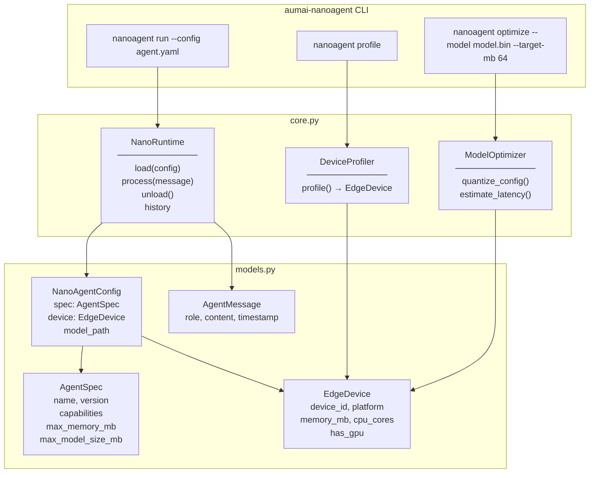

# aumai-nanoagent

**Lightweight agent runtime for edge devices.** Minimal footprint, offline-capable,
optimized for constrained environments like IoT, Raspberry Pi, and mobile.

Part of the [AumAI](https://github.com/aumai) open-source agentic AI infrastructure suite.

[](https://github.com/aumai/aumai-nanoagent/actions)
[](https://pypi.org/project/aumai-nanoagent/)
[](LICENSE)
[](https://python.org)

---

## What is this?

Imagine you have a smart thermostat, a factory sensor array, or a field-deployed
tablet that needs to run an AI agent — but it has no reliable internet connection,
512 MB of RAM, and a single ARM CPU core. Most agent frameworks assume you have
cloud connectivity and gigabytes of memory. NanoAgent assumes the opposite.

`aumai-nanoagent` is an agent runtime built from the ground up for **constrained
environments**. It deliberately avoids importing large ML frameworks at startup,
uses pure-stdlib device detection, and enforces memory constraints before loading
any model. Think of it as the firmware layer of your AI stack: small, deterministic,
and reliable.

### Why does this matter?

The majority of compute on Earth lives on edge devices — embedded controllers, phones,
gateways, kiosks, drones, and medical instruments. AI that only works in the cloud
cannot serve these environments. NanoAgent gives you:

- **Offline operation**: No network dependency for the runtime itself.
- **Memory safety**: Hard enforcement that the agent fits within device RAM before
  any allocation occurs.
- **Transparent optimization**: Built-in tooling to recommend quantization strategies
  so you can fit larger models into smaller memory envelopes.
- **Zero surprise imports**: Large frameworks (PyTorch, transformers, etc.) are never
  imported at module load time. You decide when and whether to load them.

---

## Architecture



---

## Features

- **Memory-safe loading** — `NanoRuntime.load()` validates `AgentSpec.max_memory_mb`
  against `EdgeDevice.memory_mb` and raises `NanoRuntimeError` before any resources
  are allocated.
- **Device auto-profiling** — `DeviceProfiler.profile()` detects platform, memory
  (Linux `/proc/meminfo` or Windows `GlobalMemoryStatusEx`), CPU core count, and GPU
  presence via environment variables (`CUDA_VISIBLE_DEVICES`, `ROCR_VISIBLE_DEVICES`).
- **Quantization advisor** — `ModelOptimizer.quantize_config()` recommends INT8, INT4,
  or INT2 quantization based on the ratio of current model size to target size.
- **Latency estimation** — `ModelOptimizer.estimate_latency()` provides a heuristic
  latency estimate accounting for model size, CPU core count, and GPU presence.
- **Conversation history** — `NanoRuntime` maintains a full `list[AgentMessage]`
  history for the session, accessible via the `.history` property.
- **Offline-first design** — no network calls anywhere in the core runtime.
- **Config-driven** — agents are defined in YAML or JSON, validated with Pydantic v2.
- **Interactive CLI** — a REPL for testing agent behavior directly from the terminal.

---

## Quick Start

### Installation

```bash
pip install aumai-nanoagent
```

With YAML config support (recommended):

```bash
pip install "aumai-nanoagent[yaml]"
# or manually:
pip install aumai-nanoagent pyyaml
```

### 1. Profile your device

```bash
nanoagent profile
```

Example output on a Raspberry Pi 4:

```
Device ID:   linux-aarch64-4core
Platform:    linux-aarch64
Memory:      4096 MB
CPU Cores:   4
GPU:         No
```

### 2. Create a config file

```yaml
# agent.yaml
spec:
  name: field-assistant
  version: "0.1.0"
  capabilities:
    - status-check
    - echo
  max_memory_mb: 256
  max_model_size_mb: 50

device:
  device_id: rpi4-4core
  platform: linux-aarch64
  memory_mb: 4096
  cpu_cores: 4
  has_gpu: false

model_path: null
```

### 3. Run the agent interactively

```bash
nanoagent run --config agent.yaml
```

```
Agent 'field-assistant' loaded on linux-aarch64.
Type 'quit' to exit.

You: hello
Agent: Hello from field-assistant! How can I assist?
You: status
Agent: Runtime status: OK. Device=linux-aarch64, Memory=4096MB, Cores=4.
You: quit
Session ended.
```

### 4. Get quantization advice before deploying a model

```bash
nanoagent optimize --model ./llama-7b.bin --target-mb 64
```

```
Model size:      7000.0 MB
Target size:     64.0 MB
Quantization:    int2
Bits:            2
Est. size after: 437.5 MB
Est. latency:    1750.0 ms
Notes:           INT2 quantization or model pruning required. Significant accuracy degradation expected.
```

---

## CLI Reference

### `nanoagent run`

Load a nano agent from a config file and enter an interactive REPL session.

```
Usage: nanoagent run [OPTIONS]

Options:
  --config PATH  Path to agent YAML/JSON config file.  [required]
  --version      Show the version and exit.
  --help         Show this message and exit.
```

The runtime validates memory constraints on load and exits with a clear error
message if the agent exceeds device capacity. Type `quit`, `exit`, or `q` to
end the session cleanly (calls `unload()` before exiting).

**Example:**

```bash
nanoagent run --config ./configs/edge-agent.yaml
```

---

### `nanoagent profile`

Detect and print the current device's hardware capabilities.

```
Usage: nanoagent profile [OPTIONS]

Options:
  --help  Show this message and exit.
```

**Example:**

```bash
nanoagent profile
```

Output fields: `Device ID`, `Platform`, `Memory (MB)`, `CPU Cores`, `GPU`.
GPU detection checks for the `CUDA_VISIBLE_DEVICES` or `ROCR_VISIBLE_DEVICES`
environment variables.

---

### `nanoagent optimize`

Suggest quantization settings to fit a model within a target memory size, and
estimate inference latency on the current device.

```
Usage: nanoagent optimize [OPTIONS]

Options:
  --model TEXT       Path to model file (used for size detection).  [required]
  --target-mb FLOAT  Target model size in MB.                        [required]
  --help             Show this message and exit.
```

**Examples:**

```bash
# Real file on disk — size is read from the filesystem:
nanoagent optimize --model ./models/phi-2.bin --target-mb 128

# File not found — uses target * 2 as a fallback estimate:
nanoagent optimize --model hypothetical-model.bin --target-mb 100
```

---

## Python API Examples

### Basic runtime usage

```python
from aumai_nanoagent.core import NanoRuntime
from aumai_nanoagent.models import AgentMessage, AgentSpec, EdgeDevice, NanoAgentConfig

device = EdgeDevice(
    device_id="rpi4-4core",
    platform="linux-aarch64",
    memory_mb=4096,
    cpu_cores=4,
    has_gpu=False,
)
spec = AgentSpec(
    name="field-assistant",
    version="0.1.0",
    capabilities=["status-check", "echo"],
    max_memory_mb=256,
    max_model_size_mb=50,
)
config = NanoAgentConfig(spec=spec, device=device)

runtime = NanoRuntime()
runtime.load(config)

response = runtime.process(AgentMessage(role="user", content="hello"))
print(response.content)
# Hello from field-assistant! How can I assist?

response = runtime.process(AgentMessage(role="user", content="status"))
print(response.content)
# Runtime status: OK. Device=linux-aarch64, Memory=4096MB, Cores=4.

print(f"Session has {len(runtime.history)} messages")
runtime.unload()
```

### Auto-profiling the current device

```python
from aumai_nanoagent.core import DeviceProfiler

profiler = DeviceProfiler()
device = profiler.profile()

print(device.platform)    # e.g. "windows-amd64"
print(device.memory_mb)   # e.g. 32768
print(device.cpu_cores)   # e.g. 16
print(device.has_gpu)     # True if CUDA_VISIBLE_DEVICES is set
```

### Model quantization recommendations

```python
from aumai_nanoagent.core import DeviceProfiler, ModelOptimizer

profiler = DeviceProfiler()
optimizer = ModelOptimizer()
device = profiler.profile()

quant = optimizer.quantize_config(model_size_mb=7000.0, target_mb=500.0)
print(quant["quantization"])       # "int8"
print(quant["bits"])               # 8
print(quant["expected_size_mb"])   # 1750.0
print(quant["notes"])

latency_ms = optimizer.estimate_latency(model_size_mb=500.0, device=device)
print(f"Estimated latency: {latency_ms:.1f} ms")
```

### Memory constraint enforcement

```python
from aumai_nanoagent.core import NanoRuntime, NanoRuntimeError
from aumai_nanoagent.models import AgentSpec, EdgeDevice, NanoAgentConfig

tiny_device = EdgeDevice(
    device_id="mcu-1core",
    platform="linux-arm",
    memory_mb=128,
    cpu_cores=1,
)
spec = AgentSpec(name="bloated-agent", max_memory_mb=512)
config = NanoAgentConfig(spec=spec, device=tiny_device)

runtime = NanoRuntime()
try:
    runtime.load(config)
except NanoRuntimeError as err:
    print(f"Caught expected error: {err}")
    # Agent requires 512 MB but device only has 128 MB.
```

---

## Configuration Reference

A `NanoAgentConfig` YAML (or JSON) file has three top-level sections:

```yaml
spec:
  name: string           # Required. Human-readable agent name.
  version: "0.1.0"       # Optional. Semantic version string. Default: "0.1.0".
  capabilities: []       # Optional. List of capability tag strings.
  max_memory_mb: 256     # Optional. Max RAM the agent may use. Default: 256. Min: 1.
  max_model_size_mb: 100 # Optional. Max model size in MB. Default: 100. Min: 1.

device:
  device_id: string      # Required. Unique device identifier string.
  platform: string       # Required. OS/arch e.g. "linux-aarch64", "windows-amd64".
  memory_mb: integer     # Required. Total device RAM in MB. Min: 1.
  cpu_cores: integer     # Required. Number of CPU cores. Min: 1.
  has_gpu: false         # Optional. Whether a GPU is available. Default: false.

model_path: null         # Optional. Path to on-device model file.
```

---

## How It Works

### Memory validation flow

When `NanoRuntime.load(config)` is called:

1. Read `config.spec.max_memory_mb` (agent's declared memory requirement).
2. Read `config.device.memory_mb` (device's available RAM).
3. If `required > available`, raise `NanoRuntimeError` immediately.
4. No resources are allocated — fail-fast, fail-clean.

### Message processing

`NanoRuntime.process(message)` implements a lightweight rule-based responder
suitable for edge testing without a live model loaded:

- Greeting patterns (`hello`, `hi`, `hey`) produce a personalized greeting.
- Status patterns (`status`, `health`, `ping`) produce a device diagnostic summary.
- Short messages (5 words or fewer) prompt the user for more context.
- Longer messages produce a word-count acknowledgment with a content echo.

In production you extend this by wrapping `process()` to call your quantized
on-device model. The `NanoRuntime` acts as the session and conversation history
manager regardless of which inference backend you attach.

### Device profiling internals

`DeviceProfiler.profile()` uses only Python's standard library:

| Platform | Memory detection method |
|---|---|
| Linux | Reads `/proc/meminfo`, parses `MemTotal:` line |
| Windows | Calls `kernel32.GlobalMemoryStatusEx` via `ctypes` |
| Other | Falls back to 512 MB safe default |

CPU cores: `os.cpu_count()`. GPU: checks `CUDA_VISIBLE_DEVICES` and
`ROCR_VISIBLE_DEVICES` environment variables.

### Quantization advisor logic

`ModelOptimizer.quantize_config(model_size_mb, target_mb)` computes
`ratio = target_mb / model_size_mb` and maps it to a quantization tier:

| Ratio     | Recommendation  | Approx. compression |
|-----------|-----------------|---------------------|
| >= 1.0    | none (FP32)     | 1x — already fits   |
| >= 0.5    | INT8            | ~4x                 |
| >= 0.25   | INT4            | ~8x                 |
| < 0.25    | INT2 + pruning  | ~16x                |

Latency estimation: `base = model_size_mb * 2.0 ms`, scaled by `1/sqrt(cpu_cores)`,
multiplied by `0.1` if GPU is present, and scaled up if model size exceeds 50% of
device RAM.

---

## Integration with Other AumAI Projects

| Project | How it connects |
|---|---|
| **aumai-skillforge** | Deploy registered skills as NanoAgent capabilities on edge devices. |
| **aumai-toolsmith** | Generate tool implementations sized to edge memory budgets. |
| **aumai-specs** | `NanoAgentConfig` and `AgentSpec` follow aumai-specs schema conventions. |
| **aumai-registry** | Register edge agents and device profiles for fleet management. |

---

## Contributing

Contributions are welcome. Please read `CONTRIBUTING.md` first.

```bash
git clone https://github.com/aumai/aumai-nanoagent
cd aumai-nanoagent
pip install -e ".[dev]"
make test
make lint
```

All pull requests must pass `ruff`, `mypy --strict`, and the full `pytest` suite.
Conventional commits are required: `feat:`, `fix:`, `refactor:`, `docs:`, `test:`, `chore:`.

---

## License

Apache License 2.0. See [LICENSE](LICENSE) for details.

```
Copyright 2024 AumAI Contributors

Licensed under the Apache License, Version 2.0 (the "License");
you may not use this file except in compliance with the License.
You may obtain a copy of the License at

    http://www.apache.org/licenses/LICENSE-2.0
```

---

## Part of AumAI

This project is part of [AumAI](https://github.com/aumai) — open-source infrastructure
for the agentic AI era.
